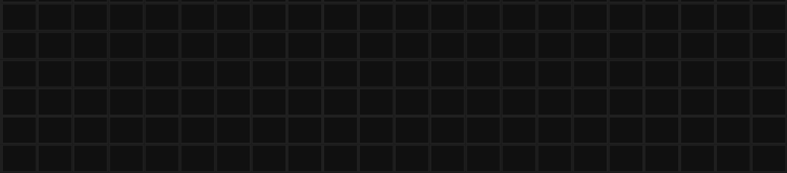

# RetroWriter


RetroWriter is a browser-based app inspired by the ["lettermaker"](https://www.c64-wiki.de/wiki/Lettermaker) programs of the 1980s. These programs were text editors designed for creating "disk letters" (Diskettenbriefe), which were messages or announcements saved to disk and shared electronically before the era of email. Unlike plain text editors, lettermakers added personality to the messages with effects like animated text playback, blinking words, and colorful displays.

RetroWriter replicates this experience, allowing users to create retro-styled messages in a modern browser environment, complete with text effects and nostalgic visuals.



## Features

### Text Playback Effects
- **Typewriter Effect:** Text is displayed character by character, emulating a typewriter.
- **Cursor Animations:** Includes a blinking cursor that tracks input.

### Visual Enhancements
- **Color Effects:** Apply color transitions and highlights to your text.
- **Blinking Words:** Highlight specific words or phrases with blinking animations.

### Output & Sharing
- **Save Messages:** Export your creations for future use or sharing.
- **Browser-Based:** No installation required; works directly in your web browser.

## Hosted App

[Try It Out](https://datag.github.io/retro-writer/)

## RetroWriter Help


### Keys

| Key/Command               | Action                                                                 |
|---------------------------|-----------------------------------------------------------------------|
| `F2`                     | Select foreground (SHIFT clears)                                      |
| `F3`                     | Select background (SHIFT clears)                                      |
| `F4`                     | Select border (SHIFT clears)                                          |
| `F6`                     | Enable pulsating (SHIFT disables)                                     |
| `F7`                     | Select scope cursor (SHIFT selects global)                           |
| `F9`                     | Enable auto advance (SHIFT disables)                                 |
| `F10`                    | Playback                                                              |
| `CTRL + 0-9`             | Select color from palette                                             |
| `Cursor`                 | Move around                                                          |
| `SHIFT + Cursor`         | (Re)Paint current cell and move around                               |
| `<character>`            | Writes character (and advances, if auto advance is enabled)          |
| `Delete`                 | Clear cell under cursor                                               |
| `Backspace`              | Retract cursor and clear cell under cursor                            |
| `PageDown`               | Scroll without moving cursor                                          |
| `Pause/Space`            | Pause/Continue                                                       |
| `CTRL + P / Print`       | Download screenshot                                                  |
| `CTRL + S`               | Download demo                                                        |
| `CTRL + O`               | Open demo (also via Drag & Drop)                                      |
| `SHIFT + F5`             | Reset                                                                |

### Hash URLs

* `#play:<url>`: Plays demo loaded from external URL (CORS headers required)


## Dev setup

Assuming we're using [pnpm](https://pnpm.io/).

```shell
pnpm install
pnpm dev
```

And then browse to http://localhost:5173/.
