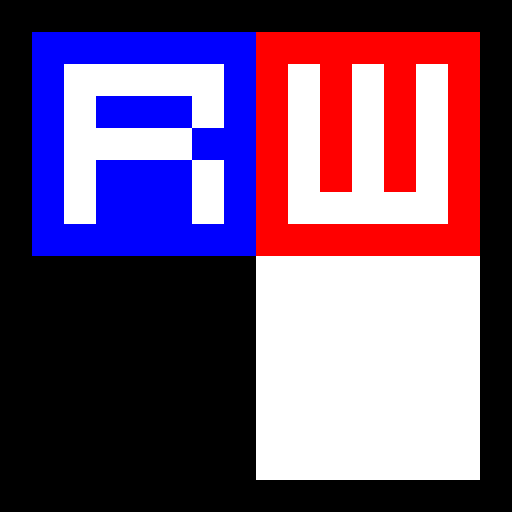

# RetroWriter



## Hosted App

[Try It Out](https://datag.github.io/retro-writer/)

## Dev setup

Assuming we're using [Yarn](https://yarnpkg.com/).

```shell
yarn
yarn dev
```

And then browse to http://localhost:5173/.
